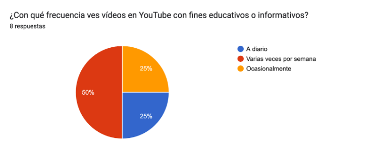
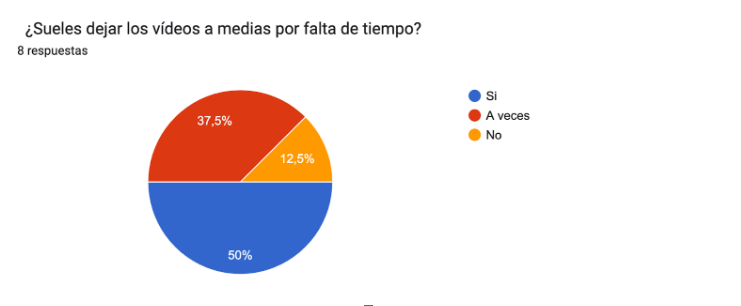
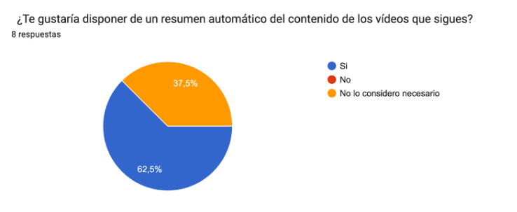
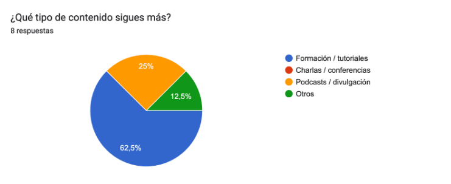
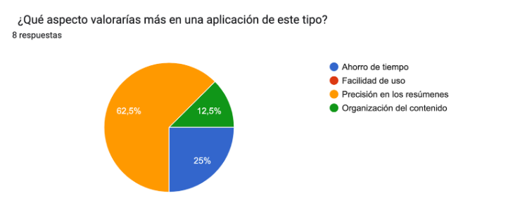
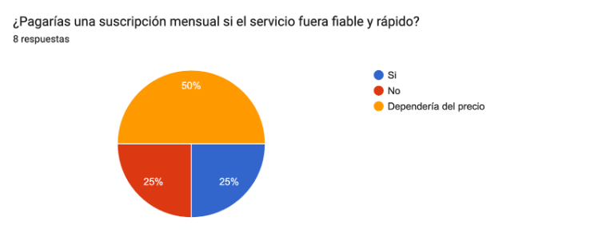

# Fase 1

## 1. Identificación de la necesidad

### Propuesta seleccionada

El proyecto elegido finalmente consiste en una plataforma web basada en la inteligencia artificial que permita al usuario seguir canales de YouTube y recibir notificaciones y los resúmenes automáticos de sus nuevos vídeos. 

El usuario paga una suscripción mensual o anual para acceder al servicio, aunque también habrá posibilidad de una prueba gratuita, y la plataforma se encarga de todo el proceso mediante la API de YouTube y los modelos de IA seleccionados, que es la que se encargará de la transcripción y resumen del vídeo.

Cada vez que uno de los canales seguidos publica un nuevo vídeo la plataforma lo detecta y genera una transcripción y un resumen estructurado. Luego notifica al usuario para que lo vea y lo muestra en el panel personal de este mismo. 

Se ha decidido esta idea de proyecto por la cantidad de usuarios que consumen contenido formativo e informativo en YouTube pero no tienen tiempo suficiente para ver la cantidad de vídeos que hay de los canales a los que siguen. Normalmente estos vídeos son largos o tienen una estructura poco profesional lo que les genera pérdida de tiempo o frustración por no llegar al punto de la información que les interesa. 

Esta aplicación solucionaría ese problema al resumir el contenido de forma clara y directa, la cual les permite mantenerse informados sin necesidad de invertir horas de contenido. De esta forma el usuario obtiene una experiencia personalizada, automatizada y que no requiere esfuerzo excesivo. Solo selecciona lo que quiere y la IA hace lo demás.

### Investigación del problema

Antes de comenzar el desarrollo de la aplicación es importante analizar si el problema que queremos resolver existe realmente y a quién afecta. Para ello observamos el uso actual de YouTube en distintos tipos de usuario y cómo estos gestionan la gran cantidad de vídeos informativos y educativos que consumen.

Esta investigación busca comprobar si la necesidad es frecuente y relevante. Una herramienta que automatice los resúmenes de vídeos con IA podría tener buena acogida entre los usuarios que consumen este tipo de contenido de manera habitual.

**¿Quién lo sufre?**

- Estudiantes que utilizan YouTube a modo de aprendizaje, como por ejemplo en nuestra rama profesional

- Profesionales que siguen canales de conferencias online y charlas los cuales no tienen tiempo de ver una conferencia de 6 horas sobre el tema que les concierne.

- Personas interesadas en los canales de divulgación como podcast de historia, economía, que prefieren acceder a la información resumida.

**¿Con qué frecuencia ocurre?**

Prácticamente a diario puesto que la mayoría de canales publican vídeos semanales o incluso diarios y los usuarios suelen estar suscritos a muchos de ellos, con lo cual es imposible consumir todo el contenido que les interesa y seleccionar cuál les importa más.

**¿Cuál es el impacto?**

- Pérdida de tiempo y productividad
- Abandono de canales de interés por exceso de contenido
- Dificultad para encontrar la información útil dentro de los vídeos

### Recopilación de evidencias

Para comprobar si nuestra aplicación propuesta tendría una buena acogida se ha realizado una encuesta a ocho usuarios consumidores de YouTube, principalmente estudiantes y jóvenes profesionales de nuestro sector que utilizan la plataforma con fines educativos o formativos.

Resultados de la encuesta:

- El 50% de los encuestados utiliza YouTube con frecuencia para aprender o informarse varias veces por semana, un 25% lo hace a diario y otro 25% lo hace ocasionalmente.

  

- En cuanto al tiempo disponible el 50% por ciento de los encuestados suele dejar vídeos a medias por falta de tiempo, un 37,5% a veces y un 12,5% no lo hace.

  

- El 62,5% de los participantes indicó que les gustaría disponer de un resumen automático del contenido frente a un 37,5% que no lo ve necesario.

  

- Respecto al tipo de contenido que más se consume es el formativo con un 62,5%, seguido de un 25% en podcast/divulgación y un 12,5% que no especificaron.

  

- Para la valoración de este tipo de aplicación se les presentaron cuatro aspectos: ahorro de tiempo, facilidad de uso, precisión de los resúmenes y organización del contenido. El factor de la precisión fue el que más se valoró con un 62,5%, seguido de un 25% por el ahorro de tiempo y un 12,5 por la organización.

  

 

- Por último, se les preguntó si pagarían una suscripción si el servicio fuera viable y rápido. Un 50% dependería del precio y un 25-25% dijo que sí y que no. 

  

En resumen, los resultados confirman que existe la necesidad de optimizar el consumo de vídeos educativos e informativos. La mayoría de los usuarios siente que invierte demasiado tiempo en ver el contenido completo y valora positivamente la posibilidad de contar con una aplicación que les ahorre tiempo de forma automática y precisa. Como punto positivo, el 75% de los encuestados estaría dispuesto a pagar por este servicio.

Además de la encuesta realizada, hemos querido investigar en foros online donde se encuentran casos reales de usuarios que necesitan una herramienta similar a la de nuestro proyecto.  
Nos centramos en el foro de **Reddit**, ya que es una comunidad muy amplia donde los usuarios explican cómo empezaron a usar modelos de IA para resumir vídeos.  

> “It’s been a game-changer for improving watch time and saving me loads of time.”  
> [Fuente: r/ADHD_Programmers](https://www.reddit.com/r/ADHD_Programmers/comments/1hfgtg3/gamechanger_using_chatgpt_to_summarise_youtube)

También encontramos usuarios que comparan distintos modelos de IA para obtener resúmenes y valoran su fiabilidad:  

> “The one I really found to be useful and accurate was Getrecall.”  
> [Fuente: r/youtube](https://www.reddit.com/r/youtube/comments/17y8hwi/i_tried_the_most_popular_free_ais_to_summarize)

Por último, algunos usuarios discuten sobre las herramientas que utilizan para resumir vídeos de YouTube con IA:  

> “Being able to drop in a YouTube URL and get a grounded summary would be really helpful.”  
> [Fuente: r/NoteTaking](https://www.reddit.com/r/NoteTaking/comments/1kht716/what_tools_do_you_use_to_summarize_youtube_videos)

## 2. Definición de usuarios objetivo

En conclusión, con la encuesta realizada y la investigación en la red hemos detectado que sí hay una necesidad real por obtener una herramienta similar a la nuestra lo que demuestra la validez y relevancia del proyecto presentado.

- **Primer usuario:** estudiante de Ingeniería de Software
  - Objetivo: Seguir varios canales técnicos sin tener que ver todos los vídeos completos para apoyar sus estudios en las pruebas teóricas.
  - Frustraciones: Pérdida de tiempo revisando todos los vídeos largos con mucha información repetida.
  - Necesidades: Obtener los resúmenes de manera automática, clasificándolos por canal o por tema de su interés.

- **Segundo usuario:** consultor de marketing digital
  - Objetivo: Estar al día de los nuevos vídeos de sus canales de marketing preferidos.
  - Frustraciones: Falta de tiempo por motivos laborales y conciliación familiar para consumir el contenido.
  - Necesidades: Recibir notificaciones y acceder a los resúmenes de calidad que le ahorren tiempo y pueda ver en su tiempo libre limitado.

### Casos de uso principales

Los casos de uso principales desde el punto de vista del usuario y del funcionamiento general de la plataforma son:  

*Registro → Búsqueda de canales y seguimiento → Detección automática → Transcripción y resumen → Visualización → Notificación*  

1. **Registro y suscripción**  
El usuario crea la cuenta en la plataforma y decide si su suscripción es mensual, anual o quiere probar la versión gratuita. Esto le permite utilizar las funcionalidades principales del sistema.  

2. **Búsqueda y seguimiento de canales**  
Una vez acabado el registro, el usuario puede buscar el canal de YouTube por el cual está interesado desde la propia aplicación. Para ello, la plataforma usa la API de YouTube, que le permite mostrar información actualizada sobre los canales.  

3. **Detección automática de vídeos**  
La aplicación consulta la API periódicamente para saber cuándo los canales seguidos por el usuario publican un vídeo nuevo.  

4. **Transcripción y resumen mediante IA**  
Cuando la aplicación detecta un nuevo vídeo, el sistema ejecuta el modelo de inteligencia artificial integrado para generar la transcripción y el resumen específico del vídeo.  

5. **Visualización en el panel del usuario**  
El usuario elige si prefiere organizar el contenido por canales o por temas, y en función de su elección el panel muestra los vídeos publicados ordenados según su criterio. Ahí el usuario verá el título, la fecha, el resumen del vídeo y el enlace al vídeo original.  

6. **Notificaciones automáticas**  
La idea es que el usuario reciba notificaciones desde la aplicación o correos electrónicos cuando haya nuevos resúmenes disponibles de sus canales suscritos.  

## 3. Análisis de competencia

Para saber el valor que puede aportar la idea propuesta tenemos que conocer el contexto en el que se desarrolla. Se ha investigado y hecho un análisis de las principales herramientas actuales que ofrecen servicios similares o que su concepto tenga relación con el nuestro. En este punto identificamos los puntos fuertes, sus limitaciones y lo que diferencia nuestro proyecto.

**_Eightify_**

Es una extensión de navegador que resume el vídeo de YouTube mediante IA. Su punto fuerte es la rapidez y precisión con la que realiza los resúmenes de los vídeos siendo muy útil para el usuario ya que garantiza una visualización inmediata del contenido. Su limitación principal es que requiere la intervención manual del usuario, ya que este tiene que abrir el vídeo y ejecutar la extensión para tener el resumen. Aquí entra nuestro punto fuerte frente esta aplicación: automatizamos completamente el proceso de detección y resumen sin hacer que el usuario tenga que estar seleccionando manualmente el vídeo y activando la extensión.

**_Notta.ai_**

En el caso de Notta.ai se trata de una aplicación enfocada en la transcripción automática de audio y vídeo con mucha precisión con soporte para múltiples idiomas. Su enfoque realmente está más orientado al procesamiento de archivos locales o reuniones, no a vídeos de YouTube además de que no se centra en el consumo de contenido. Esto nos diferencia ya que aprovechamos que nuestro entorno sí integra  la transcripción y el resumen automático.

**_Glasp_**

Por su parte Glasp es una herramienta de productividad que permite guardar, destacar y resumir contenido web incluyendo algunos vídeos. Su punto fuerte es la organización del contenido guardado y su orientación hacia el aprendizaje. Lo que se diferencia de nuestra aplicación es que esta herramienta no utiliza la API de YouTube ni cuenta con un sistema de IA propio para generar resúmenes automáticos, por ello nosotros podemos superar esa limitación ya que si usamos la API con modelos de IA que realizan seguimiento y procesamiento de vídeos nuevos sin tener que hacerlo manualmente.

### Propuesta de valor única

Nuestra aplicación se diferencia por combinar tres elementos clave: 

1. Conexión directa con YouTube mediante su API. Esto permite detectar de forma automática los vídeos publicados de los canales seguidos.
2. Inteligencia artificial integrada. Se encarga de transcribir el audio (antes de eso se intenta con la API de youtube) y generar resúmenes claros y estructurados sin que el usuario tenga que hacer nada.
3. Experiencia personalizada. Se centra en la comodidad, ahorro de tiempo y la automatización completa de todo el proceso.

En conclusión, el usuario solo elige qué quiere seguir y la aplicación se encarga de todo lo demás ofreciendo un servicio inteligente, útil y accesible.
